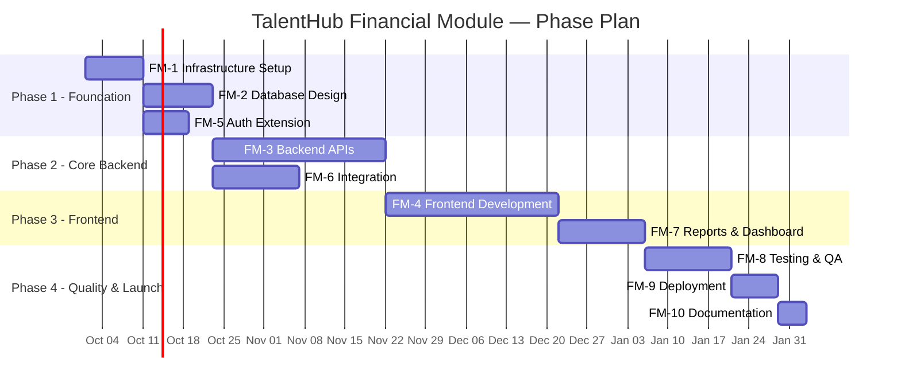
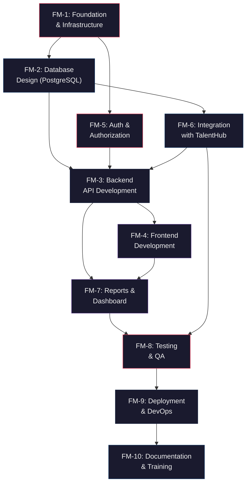

# TalentHub — Financial Module
## Work Breakdown Structure (WBS)
### PERN Stack Development Plan

---

**Document Version:** 1.0  
**Date:** September 26, 2026  
**Project:** TalentHub — Financial Module Extension  
**Organization:** SLT Mobitel  
**Prepared By:** AI Architecture Analysis  

---

> [!IMPORTANT]
> This WBS is produced from a full static analysis of the existing TalentHub repository. **No code was modified.** All tasks below are strictly additive — the existing internship management platform remains untouched.

---

## Table of Contents

1. [Executive Summary](#1-executive-summary)
2. [Existing TalentHub Architecture Analysis](#2-existing-talenthub-architecture-analysis)
3. [Technology Stack Gap Analysis (MERN → PERN)](#3-technology-stack-gap-analysis-mern--pern)
4. [Financial Module Scope Definition](#4-financial-module-scope-definition)
5. [WBS — Level 0: Programme](#5-wbs--level-0-programme)
6. [WBS — Level 1: Phases](#6-wbs--level-1-phases)
7. [WBS — Level 2–4: Detailed Breakdown](#7-wbs--level-24-detailed-breakdown)
8. [Dependency Matrix](#8-dependency-matrix)
9. [Risk Register](#9-risk-register)
10. [Effort Estimation Summary](#10-effort-estimation-summary)
11. [Appendix A — Existing vs. New Module Boundary](#appendix-a--existing-vs-new-module-boundary)

---

## 1. Executive Summary

TalentHub is a full-stack internship management platform for SLT Mobitel that handles intern onboarding, attendance (QR/Face/Manual), daily logbook submissions, leave management, seat reservations, announcements, compliance reporting, and university portal access. It currently runs on the **MERN stack** (MongoDB + Express.js + React + Node.js).

The Financial Module will extend TalentHub to manage intern stipends, transport/meal allowances, reimbursements, budget tracking, and financial reporting — built on the **PERN stack** (PostgreSQL + Express.js + React + Node.js). This requires a **hybrid database architecture** where the existing MongoDB remains for all current modules and a new PostgreSQL database is introduced for all financial data.

### Key Metrics from Analysis

| Metric | Count |
|--------|-------|
| Existing Backend Routes | 26 files |
| Existing Controllers | 37 files |
| Existing Models (MongoDB) | 35 schemas |
| Existing Services | 38 files |
| Existing Frontend Pages | 45 components |
| Existing Frontend Components | 32 components |
| Existing User Roles | 7 (super_admin, PM, admin, developer, supervisor, intern, gate_staff, university_supervisor) |
| Existing Permissions | 12 distinct permissions |

---

## 2. Existing TalentHub Architecture Analysis

### 2.1 Backend Architecture (Express.js + Node.js)

| Layer | Location | Pattern |
|-------|----------|---------|
| **Entry** | [`server.js`](file:///g:/github/TalentHub/backend/server.js) | Server bootstrap, scheduler init, SLT API sync |
| **App** | [`app.js`](file:///g:/github/TalentHub/backend/app.js) | Express app with CORS, JSON parsing, route registration |
| **Routes** | [`routes/`](file:///g:/github/TalentHub/backend/routes) | 26 route files, RESTful `/api/*` patterns |
| **Controllers** | [`controllers/`](file:///g:/github/TalentHub/backend/controllers) | 37 controllers, business logic mixed with HTTP handling |
| **Services** | [`services/`](file:///g:/github/TalentHub/backend/services) | 38 service files, schedulers, email services, sync jobs |
| **Repositories** | [`repositories/`](file:///g:/github/TalentHub/backend/repositories) | 4 files (partial adoption — only Intern, User, LeaveRequest, GateStaff) |
| **Middleware** | [`middleware/`](file:///g:/github/TalentHub/backend/middleware) | 9 files — auth, validation, upload, federation, logbook restriction |
| **Models** | [`models/`](file:///g:/github/TalentHub/backend/models) | 35 Mongoose schemas (MongoDB) |
| **Utils** | [`utils/`](file:///g:/github/TalentHub/backend/utils) | 17 utility files — email, geocoding, encryption, holiday data |
| **Config** | [`config/`](file:///g:/github/TalentHub/backend/config) | 4 files — DB connection, admin permissions, external systems, dotenv |

### 2.2 Authentication & Authorization

| Component | Details |
|-----------|---------|
| **Auth Middleware** | JWT-based via [`authMiddleware.js`](file:///g:/github/TalentHub/backend/middleware/authMiddleware.js) — `Bearer` token extraction, verification with `jwtSecret` |
| **Admin Auth** | [`adminAuth.js`](file:///g:/github/TalentHub/backend/middleware/adminAuth.js) — `requireAdmin`, `requirePermission(perm)`, `enforceRoutePermission` |
| **University Auth** | [`universityAuth.js`](file:///g:/github/TalentHub/backend/middleware/universityAuth.js) — JWT + UniversityUser status check |
| **Federation Auth** | [`federationAuth.js`](file:///g:/github/TalentHub/backend/middleware/federationAuth.js) — Cross-system federated login |
| **Token Payload** | `{ id, email, role, permissions, accountType }` — 24h expiry |
| **Password Hashing** | bcryptjs (10 rounds) |
| **DB Encryption** | AES-based field-level encryption for sensitive fields (name, email, role) |

### 2.3 User Roles & Permissions

```
┌─────────────────────┬────────────────────────────────────────────────────────────────┐
│ Role                │ Permissions                                                    │
├─────────────────────┼────────────────────────────────────────────────────────────────┤
│ super_admin         │ ALL (dashboard, interns, daily_logs, attendance, leave,         │
│ PM                  │ announcements, seats, settings, users) — full manage            │
├─────────────────────┼────────────────────────────────────────────────────────────────┤
│ admin               │ dashboard.view, interns.view/manage, daily_logs.view,          │
│ developer           │ attendance.view/manage, leave.view/manage,                     │
│                     │ announcements.manage, seats.manage                              │
├─────────────────────┼────────────────────────────────────────────────────────────────┤
│ supervisor          │ dashboard.view, interns.view, daily_logs.view,                 │
│                     │ attendance.view, leave.view (NO manage perms)                   │
├─────────────────────┼────────────────────────────────────────────────────────────────┤
│ intern              │ Self-service routes only (attendance, logbook, leave, seat)     │
├─────────────────────┼────────────────────────────────────────────────────────────────┤
│ gate_staff          │ Short-leave pass validation only                                │
├─────────────────────┼────────────────────────────────────────────────────────────────┤
│ university_supervisor│ University portal — view assigned student data                 │
└─────────────────────┴────────────────────────────────────────────────────────────────┘
```

### 2.4 Frontend Architecture (React + Vite)

| Layer | Location | Details |
|-------|----------|---------|
| **Framework** | React 19 + Vite 6 | Fast HMR, ESM-based builds |
| **Routing** | [`AppRoutes.jsx`](file:///g:/github/TalentHub/frontend/src/routes/AppRoutes.jsx) | react-router-dom v7, `AdminRoute` guard component |
| **State** | Local state + API calls | No global state manager (Redux/Zustand) |
| **Styling** | TailwindCSS v4 + custom CSS | 82KB `index.css`, seasonal backgrounds |
| **API Layer** | [`api/`](file:///g:/github/TalentHub/frontend/src/api) | `apiConfig.js`, `adminApi.js`, `adminSeatApi.js`, `holidayApi.js`, `leaveRequestApi.js` |
| **UI Libraries** | Chart.js, Leaflet, Framer Motion, Lucide, SweetAlert2, react-hot-toast | Rich visualization & interaction |
| **Pages** | 45 page components | Admin (25), Intern (12), University (3), Gate Staff (2), Public (3) |
| **Components** | 32 shared components | Navbar, Sidebar, Modals, Guards, Heatmaps, etc. |

### 2.5 Database (MongoDB via Mongoose)

**35 collections** including: `interns`, `staff`, `dailyrecords`, `dailyattendancelogs`, `faceattendancelogs`, `leaverequests`, `seatreserves`, `lockedseats`, `projects`, `announcements`, `holidays`, `compliancechecks`, `certificates`, `universityusers`, `featuretips`, `securitysettings`, `attendancesettings`, and more.

### 2.6 External Integrations

| Integration | Purpose |
|-------------|---------|
| SLT Prohub API | Trainee data sync |
| Google OAuth 2.0 | Intern + Admin authentication |
| Google Gemini AI | Logbook quality validation |
| Nodemailer SMTP | Email notifications (leave, compliance, invitations) |
| WhatsApp Web.js | WhatsApp notifications |
| TalentTrail | Cross-platform sync |
| QR Code Generation | Attendance scanning |
| Face-API.js + TensorFlow.js | Face recognition attendance |

---

## 3. Technology Stack Gap Analysis (MERN → PERN)

> [!WARNING]
> The existing TalentHub runs on **MongoDB (Mongoose)**. The Financial Module requires **PostgreSQL**. This creates a **hybrid database architecture** that must be carefully managed.

### 3.1 Current Stack (MERN)

| Layer | Technology |
|-------|-----------|
| Database | MongoDB 7.x (Mongoose 8.10) |
| Backend | Express.js 4.21 + Node.js |
| Frontend | React 19 + Vite 6 |

### 3.2 Financial Module Stack (PERN Addition)

| Layer | Technology | Rationale |
|-------|-----------|-----------|
| Database | **PostgreSQL 16** | ACID transactions for financial data, relational integrity |
| ORM | **Sequelize 6** or **Prisma** | Schema migrations, type-safe queries |
| Backend | Express.js 4.21 (shared) | Same server instance, new route namespace |
| Frontend | React 19 (shared) | New pages/components under `/admin/finance/*` and `/finance/*` |

### 3.3 Hybrid Architecture Decision

```
┌─────────────────────────────────────────────────────────────────┐
│                    TalentHub Server (Node.js)                   │
│                                                                 │
│  ┌─────────────────────┐     ┌──────────────────────────────┐   │
│  │ Existing Modules    │     │ Financial Module              │   │
│  │ (MongoDB/Mongoose)  │     │ (PostgreSQL/Sequelize)        │   │
│  │                     │     │                               │   │
│  │ • Interns           │     │ • Stipends                    │   │
│  │ • Attendance        │◄───►│ • Allowances                  │   │
│  │ • Leave Requests    │     │ • Reimbursements              │   │
│  │ • Daily Records     │ ref │ • Budget                      │   │
│  │ • Seat Booking      │     │ • Payment Batches             │   │
│  │ • Announcements     │     │ • Financial Reports           │   │
│  │ • etc.              │     │ • Audit Trail                 │   │
│  └──────────┬──────────┘     └──────────────┬───────────────┘   │
│             │                                │                   │
│        MongoDB                         PostgreSQL                │
└─────────────────────────────────────────────────────────────────┘
```

---

## 4. Financial Module Scope Definition

> [!NOTE]
> Since no Finance Module requirements document was found in the repository, the following scope is derived from the TalentHub context (SLT Mobitel intern management) and industry-standard intern financial management needs.

### 4.1 Core Financial Sub-Modules

| # | Sub-Module | Description |
|---|-----------|-------------|
| FM-01 | **Stipend Management** | Monthly intern stipend calculation, processing, and tracking |
| FM-02 | **Transport Allowance** | Distance-based transport allowance calculation using intern location data |
| FM-03 | **Meal Allowance** | Attendance-linked daily meal allowance computation |
| FM-04 | **Reimbursement Claims** | Intern-submitted expense claims with approval workflow |
| FM-05 | **Budget Management** | Departmental/team budget allocation and tracking |
| FM-06 | **Payment Processing** | Batch payment generation, bank file exports |
| FM-07 | **Financial Reports & Dashboard** | Analytics, summaries, audit trails |
| FM-08 | **Tax & Compliance** | WHT deduction tracking, statutory compliance |

---

## 5. WBS — Level 0: Programme

```
FM-0: TalentHub Financial Module
├── FM-1: Foundation & Infrastructure
├── FM-2: Database Design & Setup (PostgreSQL)
├── FM-3: Backend API Development
├── FM-4: Frontend Development
├── FM-5: Authentication & Authorization Extension
├── FM-6: Integration with Existing TalentHub
├── FM-7: Reports & Dashboard
├── FM-8: Testing & Quality Assurance
├── FM-9: Deployment & DevOps
└── FM-10: Documentation & Training
```

---

## 6. WBS — Level 1: Phases



---

## 7. WBS — Level 2–4: Detailed Breakdown

---

### FM-1: Foundation & Infrastructure

#### FM-1.1: PostgreSQL Environment Setup
| WBS ID | Task | Type | Effort (hrs) |
|--------|------|------|:----------:|
| FM-1.1.1 | Install and configure PostgreSQL 16 (dev, staging, production) | DevOps | 4 |
| FM-1.1.2 | Create `talenthub_finance` database and configure connection pooling | DevOps | 3 |
| FM-1.1.3 | Set up Sequelize (or Prisma) ORM with migration framework | Backend | 4 |
| FM-1.1.4 | Configure `.env` variables for PostgreSQL (`PG_HOST`, `PG_PORT`, `PG_DB`, `PG_USER`, `PG_PASSWORD`, `PG_SSL`) | Backend | 2 |
| FM-1.1.5 | Create `config/pgDatabase.js` — PostgreSQL connection module (parallel to existing `config/database.js` for MongoDB) | Backend | 3 |
| FM-1.1.6 | Implement database connection health-check endpoint (`/api/finance/health`) | Backend | 2 |

#### FM-1.2: Project Structure Setup
| WBS ID | Task | Type | Effort (hrs) |
|--------|------|------|:----------:|
| FM-1.2.1 | Create `backend/finance/` module directory structure: `models/`, `controllers/`, `services/`, `routes/`, `repositories/`, `migrations/`, `seeders/` | Backend | 3 |
| FM-1.2.2 | Create `frontend/src/pages/finance/` directory structure: admin pages, intern pages | Frontend | 2 |
| FM-1.2.3 | Create `frontend/src/api/financeApi.js` — centralized finance API layer | Frontend | 3 |
| FM-1.2.4 | Create `frontend/src/components/finance/` shared component directory | Frontend | 1 |
| FM-1.2.5 | Set up ESLint rules and naming conventions for financial module | DevOps | 1 |

#### FM-1.3: Shared Utilities
| WBS ID | Task | Type | Effort (hrs) |
|--------|------|------|:----------:|
| FM-1.3.1 | Create currency formatting utility (LKR — Sri Lankan Rupee) | Backend/Frontend | 2 |
| FM-1.3.2 | Create financial calculation utility (rounding rules, precision handling) | Backend | 3 |
| FM-1.3.3 | Create date-range fiscal period helpers (monthly, quarterly, annual) | Backend | 3 |
| FM-1.3.4 | Create audit trail logger utility for all financial operations | Backend | 4 |

---

### FM-2: Database Design & Setup (PostgreSQL)

#### FM-2.1: Core Financial Schema
| WBS ID | Task | Type | Effort (hrs) |
|--------|------|------|:----------:|
| FM-2.1.1 | Design and create `fin_stipend_configs` table (rate structures, tiers, effective dates) | Database | 4 |
| FM-2.1.2 | Design and create `fin_stipend_records` table (monthly stipend per intern, calculation breakdown) | Database | 5 |
| FM-2.1.3 | Design and create `fin_transport_allowances` table (distance tiers, rates, intern allocations) | Database | 4 |
| FM-2.1.4 | Design and create `fin_meal_allowances` table (daily rate, attendance-linked records) | Database | 4 |
| FM-2.1.5 | Design and create `fin_reimbursement_claims` table (claim details, receipts, approval chain) | Database | 5 |
| FM-2.1.6 | Design and create `fin_reimbursement_receipts` table (uploaded receipt metadata, file storage references) | Database | 3 |

#### FM-2.2: Budget & Payment Schema
| WBS ID | Task | Type | Effort (hrs) |
|--------|------|------|:----------:|
| FM-2.2.1 | Design and create `fin_budgets` table (team/department budgets, fiscal periods) | Database | 4 |
| FM-2.2.2 | Design and create `fin_budget_allocations` table (line-item allocations per category) | Database | 4 |
| FM-2.2.3 | Design and create `fin_budget_transactions` table (actual spend tracking, variance records) | Database | 4 |
| FM-2.2.4 | Design and create `fin_payment_batches` table (batch processing records, status tracking) | Database | 5 |
| FM-2.2.5 | Design and create `fin_payment_items` table (individual payment line items within batches) | Database | 4 |
| FM-2.2.6 | Design and create `fin_bank_exports` table (generated bank file records, formats, download tracking) | Database | 3 |

#### FM-2.3: Audit & Configuration Schema
| WBS ID | Task | Type | Effort (hrs) |
|--------|------|------|:----------:|
| FM-2.3.1 | Design and create `fin_audit_trail` table (all financial state changes with user, timestamp, before/after values) | Database | 5 |
| FM-2.3.2 | Design and create `fin_approval_workflows` table (configurable approval chains per financial action) | Database | 4 |
| FM-2.3.3 | Design and create `fin_tax_config` table (WHT rates, thresholds, exemption rules) | Database | 3 |
| FM-2.3.4 | Design and create `fin_fiscal_periods` table (monthly/quarterly/annual period definitions) | Database | 3 |
| FM-2.3.5 | Design and create `fin_intern_bank_details` table (bank account info — encrypted, for payment processing) | Database | 4 |

#### FM-2.4: Cross-Database Reference Schema
| WBS ID | Task | Type | Effort (hrs) |
|--------|------|------|:----------:|
| FM-2.4.1 | Design and create `fin_intern_references` table (maps MongoDB intern `_id` to PostgreSQL intern financial records) | Database | 4 |
| FM-2.4.2 | Create cross-database sync service for intern roster changes (new intern, terminated intern) | Backend | 6 |
| FM-2.4.3 | Create database migration scripts (up/down) for all financial tables | Database | 5 |
| FM-2.4.4 | Create seed data scripts for development and testing | Database | 4 |
| FM-2.4.5 | Design and implement database indexing strategy for financial queries (date ranges, intern lookups, status filters) | Database | 4 |

---

### FM-3: Backend API Development

#### FM-3.1: Stipend Management APIs
| WBS ID | Task | Type | Effort (hrs) |
|--------|------|------|:----------:|
| FM-3.1.1 | `POST /api/finance/stipends/config` — Create/update stipend rate configuration | Backend | 4 |
| FM-3.1.2 | `GET /api/finance/stipends/config` — Retrieve current and historical stipend configs | Backend | 3 |
| FM-3.1.3 | `POST /api/finance/stipends/calculate` — Calculate monthly stipends for all active interns (attendance-prorated) | Backend | 8 |
| FM-3.1.4 | `GET /api/finance/stipends/:internId` — Get stipend history for a specific intern | Backend | 3 |
| FM-3.1.5 | `GET /api/finance/stipends/batch/:month` — Get all intern stipends for a given month | Backend | 4 |
| FM-3.1.6 | `PUT /api/finance/stipends/:id/adjust` — Manual stipend adjustment with audit reason | Backend | 4 |
| FM-3.1.7 | Create `StipendService` — core business logic for stipend calculation rules | Backend | 8 |
| FM-3.1.8 | Create `StipendRepository` — data access layer for stipend tables | Backend | 4 |

#### FM-3.2: Transport Allowance APIs
| WBS ID | Task | Type | Effort (hrs) |
|--------|------|------|:----------:|
| FM-3.2.1 | `POST /api/finance/transport/config` — Configure distance-based transport tiers and rates | Backend | 4 |
| FM-3.2.2 | `POST /api/finance/transport/calculate` — Calculate transport allowance using intern location data from MongoDB | Backend | 6 |
| FM-3.2.3 | `GET /api/finance/transport/:internId` — Get transport allowance history for intern | Backend | 3 |
| FM-3.2.4 | `PUT /api/finance/transport/:id/override` — Manual override with justification | Backend | 3 |
| FM-3.2.5 | Create `TransportAllowanceService` — distance calculation integration with existing geocode utils | Backend | 6 |

#### FM-3.3: Meal Allowance APIs
| WBS ID | Task | Type | Effort (hrs) |
|--------|------|------|:----------:|
| FM-3.3.1 | `POST /api/finance/meals/config` — Configure daily meal rates | Backend | 3 |
| FM-3.3.2 | `POST /api/finance/meals/calculate/:month` — Calculate meal allowance from attendance records (MongoDB → PostgreSQL) | Backend | 6 |
| FM-3.3.3 | `GET /api/finance/meals/:internId` — Get meal allowance breakdown per intern | Backend | 3 |
| FM-3.3.4 | Create `MealAllowanceService` — attendance-to-allowance mapping logic | Backend | 5 |

#### FM-3.4: Reimbursement Claims APIs
| WBS ID | Task | Type | Effort (hrs) |
|--------|------|------|:----------:|
| FM-3.4.1 | `POST /api/finance/reimbursements` — Submit new reimbursement claim (intern-facing) | Backend | 5 |
| FM-3.4.2 | `GET /api/finance/reimbursements/my` — Get own claims with status (intern-facing) | Backend | 3 |
| FM-3.4.3 | `GET /api/finance/reimbursements` — List all claims with filters (admin-facing) | Backend | 4 |
| FM-3.4.4 | `PUT /api/finance/reimbursements/:id/review` — Approve/reject with comments (admin) | Backend | 5 |
| FM-3.4.5 | `POST /api/finance/reimbursements/:id/receipts` — Upload receipt attachments (Multer integration) | Backend | 4 |
| FM-3.4.6 | `GET /api/finance/reimbursements/:id/receipts/:receiptId` — Download receipt file | Backend | 3 |
| FM-3.4.7 | Create `ReimbursementService` — claim validation, amount limits, duplicate detection | Backend | 6 |
| FM-3.4.8 | Create `ReimbursementRepository` — data access with pagination and filtering | Backend | 4 |

#### FM-3.5: Budget Management APIs
| WBS ID | Task | Type | Effort (hrs) |
|--------|------|------|:----------:|
| FM-3.5.1 | `POST /api/finance/budgets` — Create new budget (by team, department, or global) | Backend | 5 |
| FM-3.5.2 | `GET /api/finance/budgets` — List budgets with status, utilization percentage | Backend | 4 |
| FM-3.5.3 | `PUT /api/finance/budgets/:id` — Update budget allocation | Backend | 4 |
| FM-3.5.4 | `GET /api/finance/budgets/:id/utilization` — Real-time budget utilization breakdown | Backend | 5 |
| FM-3.5.5 | `POST /api/finance/budgets/:id/allocations` — Add/modify line-item allocations | Backend | 4 |
| FM-3.5.6 | Create `BudgetService` — allocation tracking, overspend alerts, variance calculation | Backend | 8 |
| FM-3.5.7 | Create `BudgetRepository` — data access with aggregation queries | Backend | 4 |

#### FM-3.6: Payment Processing APIs
| WBS ID | Task | Type | Effort (hrs) |
|--------|------|------|:----------:|
| FM-3.6.1 | `POST /api/finance/payments/batch` — Generate payment batch from approved stipends + allowances | Backend | 8 |
| FM-3.6.2 | `GET /api/finance/payments/batches` — List payment batches with status | Backend | 4 |
| FM-3.6.3 | `PUT /api/finance/payments/batch/:id/approve` — Approve payment batch (requires PM/super_admin) | Backend | 5 |
| FM-3.6.4 | `POST /api/finance/payments/batch/:id/export` — Generate bank transfer file (CSV/SLIPS format) | Backend | 8 |
| FM-3.6.5 | `PUT /api/finance/payments/batch/:id/mark-paid` — Mark batch as paid with bank reference | Backend | 4 |
| FM-3.6.6 | Create `PaymentBatchService` — batch creation, validation, reconciliation | Backend | 8 |
| FM-3.6.7 | Create `BankExportService` — bank-specific file format generation (SLT Mobitel banking partner format) | Backend | 6 |

#### FM-3.7: Tax & Compliance APIs
| WBS ID | Task | Type | Effort (hrs) |
|--------|------|------|:----------:|
| FM-3.7.1 | `POST /api/finance/tax/config` — Configure WHT rates and thresholds | Backend | 4 |
| FM-3.7.2 | `GET /api/finance/tax/:internId/summary` — Get tax deduction summary for intern | Backend | 3 |
| FM-3.7.3 | `POST /api/finance/tax/calculate` — Calculate WHT for payment batch | Backend | 5 |
| FM-3.7.4 | Create `TaxService` — Sri Lankan WHT rules engine, exemption handling | Backend | 6 |

#### FM-3.8: Audit Trail APIs
| WBS ID | Task | Type | Effort (hrs) |
|--------|------|------|:----------:|
| FM-3.8.1 | `GET /api/finance/audit` — Search audit trail with date/user/action filters | Backend | 4 |
| FM-3.8.2 | `GET /api/finance/audit/:entityType/:entityId` — Get audit history for specific record | Backend | 3 |
| FM-3.8.3 | Create auto-audit middleware — intercept all finance write operations and log changes | Backend | 6 |

---

### FM-4: Frontend Development

#### FM-4.1: Admin Financial Dashboard
| WBS ID | Task | Type | Effort (hrs) |
|--------|------|------|:----------:|
| FM-4.1.1 | Create `AdminFinanceDashboard.jsx` — overview page with KPI cards (total stipends, pending payments, budget utilization) | Frontend | 10 |
| FM-4.1.2 | Create financial summary chart components (monthly spend trend, category breakdown, budget vs actual) using Chart.js | Frontend | 8 |
| FM-4.1.3 | Create recent activity feed component (latest approvals, payments, claims) | Frontend | 4 |
| FM-4.1.4 | Create budget utilization gauge/progress components per team | Frontend | 5 |
| FM-4.1.5 | Create quick-action panels (process stipends, review claims, generate reports) | Frontend | 4 |

#### FM-4.2: Stipend Management Pages
| WBS ID | Task | Type | Effort (hrs) |
|--------|------|------|:----------:|
| FM-4.2.1 | Create `AdminStipendConfig.jsx` — stipend rate configuration page with tier management | Frontend | 8 |
| FM-4.2.2 | Create `AdminStipendProcessing.jsx` — monthly stipend calculation and review page | Frontend | 10 |
| FM-4.2.3 | Create `AdminStipendHistory.jsx` — historical stipend records with search, filter, and export | Frontend | 8 |
| FM-4.2.4 | Create stipend calculation preview modal — show per-intern breakdown before confirming | Frontend | 5 |
| FM-4.2.5 | Create stipend adjustment modal — manual override with audit reason input | Frontend | 4 |

#### FM-4.3: Allowance Management Pages
| WBS ID | Task | Type | Effort (hrs) |
|--------|------|------|:----------:|
| FM-4.3.1 | Create `AdminTransportAllowance.jsx` — distance tier config + intern allocation view | Frontend | 8 |
| FM-4.3.2 | Create `AdminMealAllowance.jsx` — daily rate config + monthly calculation view | Frontend | 7 |
| FM-4.3.3 | Create allowance summary cards with attendance correlation visualization | Frontend | 5 |
| FM-4.3.4 | Create transport distance visualization using existing Leaflet map integration | Frontend | 6 |

#### FM-4.4: Reimbursement Management Pages
| WBS ID | Task | Type | Effort (hrs) |
|--------|------|------|:----------:|
| FM-4.4.1 | Create `InternReimbursementSubmit.jsx` — claim submission form with receipt upload | Frontend | 8 |
| FM-4.4.2 | Create `InternReimbursementHistory.jsx` — intern's own claims with status tracking | Frontend | 6 |
| FM-4.4.3 | Create `AdminReimbursementReview.jsx` — admin review queue with approve/reject workflow | Frontend | 10 |
| FM-4.4.4 | Create receipt viewer modal — image/PDF preview with zoom and download | Frontend | 5 |
| FM-4.4.5 | Create claim details expandable panel — full breakdown, receipt thumbnails, approval chain | Frontend | 5 |

#### FM-4.5: Budget Management Pages
| WBS ID | Task | Type | Effort (hrs) |
|--------|------|------|:----------:|
| FM-4.5.1 | Create `AdminBudgetOverview.jsx` — all budgets with utilization meters and alerts | Frontend | 8 |
| FM-4.5.2 | Create `AdminBudgetDetail.jsx` — single budget drill-down with allocation breakdown | Frontend | 8 |
| FM-4.5.3 | Create budget creation/edit modal with line-item allocation form | Frontend | 6 |
| FM-4.5.4 | Create budget vs actual variance visualization (stacked bar charts, delta indicators) | Frontend | 5 |

#### FM-4.6: Payment Processing Pages
| WBS ID | Task | Type | Effort (hrs) |
|--------|------|------|:----------:|
| FM-4.6.1 | Create `AdminPaymentBatches.jsx` — batch list with status pipeline (Draft → Approved → Exported → Paid) | Frontend | 8 |
| FM-4.6.2 | Create `AdminPaymentBatchDetail.jsx` — batch detail with individual payment items | Frontend | 8 |
| FM-4.6.3 | Create batch approval confirmation modal with digital signature/password verification | Frontend | 5 |
| FM-4.6.4 | Create bank export download interface with format selection | Frontend | 4 |
| FM-4.6.5 | Create payment receipt/confirmation generation (PDF) for individual interns | Frontend | 5 |

#### FM-4.7: Intern Financial Portal
| WBS ID | Task | Type | Effort (hrs) |
|--------|------|------|:----------:|
| FM-4.7.1 | Create `InternFinanceDashboard.jsx` — personal financial summary (this month's stipend, allowances, pending claims) | Frontend | 8 |
| FM-4.7.2 | Create `InternPaymentHistory.jsx` — payment history timeline | Frontend | 5 |
| FM-4.7.3 | Create `InternBankDetails.jsx` — secure bank account information form | Frontend | 5 |
| FM-4.7.4 | Create intern financial notification components (payment processed, claim status change) | Frontend | 4 |

#### FM-4.8: Shared Financial Components
| WBS ID | Task | Type | Effort (hrs) |
|--------|------|------|:----------:|
| FM-4.8.1 | Create `FinanceNavigation.jsx` — finance sub-menu for admin sidebar (integrate with existing [`AdminNavigation.jsx`](file:///g:/github/TalentHub/frontend/src/components/AdminNavigation.jsx)) | Frontend | 4 |
| FM-4.8.2 | Create `CurrencyDisplay` component — formatted LKR display with proper locale | Frontend | 2 |
| FM-4.8.3 | Create `FinancialTable` component — sortable, filterable data table for financial records | Frontend | 6 |
| FM-4.8.4 | Create `ApprovalStatusBadge` component — visual status indicators (Pending/Approved/Rejected/Paid) | Frontend | 2 |
| FM-4.8.5 | Create `DateRangePicker` component — fiscal period selection (month, quarter, year, custom) | Frontend | 4 |
| FM-4.8.6 | Create `FinancialExportButton` component — CSV/PDF/Excel export for all financial views | Frontend | 4 |
| FM-4.8.7 | Create finance-specific CSS styles (consistent with existing TailwindCSS theme) | Frontend | 4 |

---

### FM-5: Authentication & Authorization Extension

#### FM-5.1: New Financial Permissions
| WBS ID | Task | Type | Effort (hrs) |
|--------|------|------|:----------:|
| FM-5.1.1 | Define new permission constants: `finance.view`, `finance.manage`, `finance.approve_payments`, `finance.manage_budgets`, `finance.configure_rates`, `finance.view_audit` | Backend | 3 |
| FM-5.1.2 | Extend [`adminPermissions.js`](file:///g:/github/TalentHub/backend/config/adminPermissions.js) — add finance permissions to `ALL_PERMISSIONS` and role mappings | Backend | 3 |
| FM-5.1.3 | Create `finance.approve_payments` — restricted to PM/super_admin roles only (dual authorization) | Backend | 4 |
| FM-5.1.4 | Update `ROLE_PERMISSIONS` mapping: PM/super_admin get all finance perms; admin gets `finance.view`+`finance.manage`; supervisor gets `finance.view` only | Backend | 3 |

#### FM-5.2: Finance Auth Middleware
| WBS ID | Task | Type | Effort (hrs) |
|--------|------|------|:----------:|
| FM-5.2.1 | Create `financeAuth.js` middleware — extend existing `requirePermission` pattern for finance routes | Backend | 4 |
| FM-5.2.2 | Implement dual-authorization middleware for payment batch approval (requires two different admin approvals) | Backend | 6 |
| FM-5.2.3 | Implement financial amount threshold authorization (amounts > configurable limit require PM approval) | Backend | 4 |
| FM-5.2.4 | Add `finance.*` permissions to JWT token payload generation in [`authService.js`](file:///g:/github/TalentHub/backend/services/authService.js) | Backend | 3 |

#### FM-5.3: Intern Financial Access
| WBS ID | Task | Type | Effort (hrs) |
|--------|------|------|:----------:|
| FM-5.3.1 | Extend intern JWT token to include `canViewFinance` flag | Backend | 2 |
| FM-5.3.2 | Create intern-specific finance route guard (can only view own financial data) | Backend | 3 |
| FM-5.3.3 | Create frontend `FinanceRoute` guard component (parallel to existing [`AdminRoute.jsx`](file:///g:/github/TalentHub/frontend/src/components/AdminRoute.jsx)) | Frontend | 3 |

#### FM-5.4: Audit Authentication
| WBS ID | Task | Type | Effort (hrs) |
|--------|------|------|:----------:|
| FM-5.4.1 | Create financial operation signature — require password re-confirmation for high-value actions | Backend | 5 |
| FM-5.4.2 | Implement session-based financial operation timeout (auto-lock after 15 min idle on finance pages) | Frontend | 4 |
| FM-5.4.3 | Log all finance route access attempts (successful and failed) to audit trail | Backend | 3 |

---

### FM-6: Integration with Existing TalentHub

#### FM-6.1: Intern Data Synchronization (MongoDB ↔ PostgreSQL)
| WBS ID | Task | Type | Effort (hrs) |
|--------|------|------|:----------:|
| FM-6.1.1 | Create `InternFinanceSyncService` — sync intern roster from MongoDB to PostgreSQL `fin_intern_references` table | Backend | 8 |
| FM-6.1.2 | Implement event-driven sync: trigger on intern create/update/deactivate in MongoDB | Backend | 6 |
| FM-6.1.3 | Create initial bulk sync script for existing interns (one-time migration) | Backend | 4 |
| FM-6.1.4 | Handle edge cases: re-activated interns, ID changes, duplicate detection | Backend | 5 |
| FM-6.1.5 | Add `fin_intern_references` status tracking (active/inactive/terminated) | Backend | 3 |

#### FM-6.2: Attendance Integration (for Meal Allowance)
| WBS ID | Task | Type | Effort (hrs) |
|--------|------|------|:----------:|
| FM-6.2.1 | Create `AttendanceFinanceBridge` — read attendance records from MongoDB for meal allowance calculation | Backend | 6 |
| FM-6.2.2 | Map attendance types (`qr`, `face`, `daily_qr`, `daily`, `manual`, `face_meeting`) to financial eligibility rules | Backend | 4 |
| FM-6.2.3 | Handle check-in/check-out duration validation (minimum hours for meal eligibility) | Backend | 4 |
| FM-6.2.4 | Integrate with existing holiday data (no meal allowance on holidays) | Backend | 3 |

#### FM-6.3: Leave Integration (for Stipend Proration)
| WBS ID | Task | Type | Effort (hrs) |
|--------|------|------|:----------:|
| FM-6.3.1 | Create `LeaveFinanceBridge` — read approved leave records from MongoDB for stipend proration | Backend | 5 |
| FM-6.3.2 | Map leave types (`short_leave`, `study_leave`) to financial impact rules | Backend | 3 |
| FM-6.3.3 | Implement working day calculation using existing [`workingDays.js`](file:///g:/github/TalentHub/backend/utils/workingDays.js) utility | Backend | 3 |

#### FM-6.4: Location Integration (for Transport Allowance)
| WBS ID | Task | Type | Effort (hrs) |
|--------|------|------|:----------:|
| FM-6.4.1 | Read intern home address/location from MongoDB `Intern.location` field | Backend | 3 |
| FM-6.4.2 | Calculate distance to SLT office using existing [`geocode.js`](file:///g:/github/TalentHub/backend/utils/geocode.js) utility | Backend | 4 |
| FM-6.4.3 | Cache distance calculations to avoid repeated API calls | Backend | 3 |

#### FM-6.5: UI Integration
| WBS ID | Task | Type | Effort (hrs) |
|--------|------|------|:----------:|
| FM-6.5.1 | Add "Finance" section to admin sidebar navigation ([`AdminNavigation.jsx`](file:///g:/github/TalentHub/frontend/src/components/AdminNavigation.jsx)) | Frontend | 3 |
| FM-6.5.2 | Add "Finance" section to intern navigation ([`Navigation.jsx`](file:///g:/github/TalentHub/frontend/src/components/Navigation.jsx)) | Frontend | 3 |
| FM-6.5.3 | Add finance routes to [`AppRoutes.jsx`](file:///g:/github/TalentHub/frontend/src/routes/AppRoutes.jsx) | Frontend | 3 |
| FM-6.5.4 | Add financial summary widget to existing [`AdminDashboard.jsx`](file:///g:/github/TalentHub/frontend/src/pages/AdminDashboard.jsx) | Frontend | 5 |
| FM-6.5.5 | Add financial summary widget to existing [`InternDashboard.jsx`](file:///g:/github/TalentHub/frontend/src/pages/InternDashboard.jsx) | Frontend | 4 |
| FM-6.5.6 | Register finance API routes in [`app.js`](file:///g:/github/TalentHub/backend/app.js) under `/api/finance/*` namespace | Backend | 2 |
| FM-6.5.7 | Add finance API endpoints to [`apiConfig.js`](file:///g:/github/TalentHub/frontend/src/api/apiConfig.js) | Frontend | 2 |

#### FM-6.6: Notification Integration
| WBS ID | Task | Type | Effort (hrs) |
|--------|------|------|:----------:|
| FM-6.6.1 | Extend existing email sender ([`emailSender.js`](file:///g:/github/TalentHub/backend/utils/emailSender.js)) with financial email templates | Backend | 5 |
| FM-6.6.2 | Create payment processed notification (email + optional WhatsApp) | Backend | 4 |
| FM-6.6.3 | Create reimbursement status change notification | Backend | 3 |
| FM-6.6.4 | Create budget overspend alert notification to PM/super_admin | Backend | 3 |
| FM-6.6.5 | Integrate with existing WhatsApp sender ([`whatsappSender.js`](file:///g:/github/TalentHub/backend/utils/whatsappSender.js)) for financial notifications | Backend | 4 |

---

### FM-7: Reports & Dashboard

#### FM-7.1: Financial Reports (Backend)
| WBS ID | Task | Type | Effort (hrs) |
|--------|------|------|:----------:|
| FM-7.1.1 | `GET /api/finance/reports/monthly-summary` — consolidated monthly financial summary | Backend | 6 |
| FM-7.1.2 | `GET /api/finance/reports/stipend-register` — detailed stipend register for all interns | Backend | 5 |
| FM-7.1.3 | `GET /api/finance/reports/allowance-summary` — transport + meal allowance summary | Backend | 5 |
| FM-7.1.4 | `GET /api/finance/reports/reimbursement-status` — reimbursement pipeline report | Backend | 4 |
| FM-7.1.5 | `GET /api/finance/reports/budget-variance` — budget vs actual variance analysis | Backend | 5 |
| FM-7.1.6 | `GET /api/finance/reports/payment-reconciliation` — payment status reconciliation | Backend | 5 |
| FM-7.1.7 | `GET /api/finance/reports/tax-summary` — WHT deduction summary for compliance filing | Backend | 4 |
| FM-7.1.8 | `GET /api/finance/reports/intern-payslip/:internId/:month` — individual intern payslip data | Backend | 4 |

#### FM-7.2: Report Export Services
| WBS ID | Task | Type | Effort (hrs) |
|--------|------|------|:----------:|
| FM-7.2.1 | Create PDF report generator using existing pdfkit integration — monthly financial summary | Backend | 8 |
| FM-7.2.2 | Create Excel report generator using existing exceljs integration — detailed data exports | Backend | 6 |
| FM-7.2.3 | Create CSV export for bank transfer files | Backend | 4 |
| FM-7.2.4 | Create intern payslip PDF template (branded with SLT logo) | Backend | 6 |
| FM-7.2.5 | Create batch payslip generation service (bulk PDF for all interns in a month) | Backend | 5 |

#### FM-7.3: Dashboard Visualizations (Frontend)
| WBS ID | Task | Type | Effort (hrs) |
|--------|------|------|:----------:|
| FM-7.3.1 | Create monthly spend trend line chart (12-month rolling) | Frontend | 5 |
| FM-7.3.2 | Create category breakdown donut/pie chart (stipends vs transport vs meals vs reimbursements) | Frontend | 4 |
| FM-7.3.3 | Create budget utilization horizontal bar chart per team/department | Frontend | 5 |
| FM-7.3.4 | Create payment pipeline funnel visualization | Frontend | 4 |
| FM-7.3.5 | Create reimbursement claims aging report visualization | Frontend | 4 |
| FM-7.3.6 | Create intern-facing payment timeline visualization (stipend receipt dates) | Frontend | 4 |
| FM-7.3.7 | Create printable financial report page with print-optimized CSS | Frontend | 4 |

---

### FM-8: Testing & Quality Assurance

#### FM-8.1: Database Testing
| WBS ID | Task | Type | Effort (hrs) |
|--------|------|------|:----------:|
| FM-8.1.1 | Test all PostgreSQL migration scripts (up + down) | QA | 4 |
| FM-8.1.2 | Test database constraints, foreign keys, and cascading rules | QA | 4 |
| FM-8.1.3 | Test cross-database referential integrity (MongoDB ↔ PostgreSQL) | QA | 5 |
| FM-8.1.4 | Test concurrent transaction handling (ACID compliance) | QA | 4 |
| FM-8.1.5 | Test data encryption for bank details and sensitive financial data | QA | 3 |
| FM-8.1.6 | Load test financial queries with realistic data volumes (1000+ interns, 12+ months) | QA | 5 |

#### FM-8.2: API Testing
| WBS ID | Task | Type | Effort (hrs) |
|--------|------|------|:----------:|
| FM-8.2.1 | Unit tests for `StipendService` calculation logic (edge cases: partial month, zero attendance, mid-month start/end) | QA | 6 |
| FM-8.2.2 | Unit tests for `TransportAllowanceService` distance tier calculation | QA | 4 |
| FM-8.2.3 | Unit tests for `MealAllowanceService` attendance-to-allowance mapping | QA | 4 |
| FM-8.2.4 | Unit tests for `TaxService` WHT calculation rules | QA | 4 |
| FM-8.2.5 | Unit tests for `BudgetService` allocation and variance logic | QA | 4 |
| FM-8.2.6 | Unit tests for `PaymentBatchService` batch creation and validation | QA | 5 |
| FM-8.2.7 | Integration tests for all finance API endpoints (happy path + error cases) | QA | 10 |
| FM-8.2.8 | Test authorization for all finance endpoints (verify role/permission enforcement) | QA | 6 |
| FM-8.2.9 | Test audit trail generation for all write operations | QA | 4 |
| FM-8.2.10 | Test financial calculation precision (decimal handling, rounding rules) | QA | 4 |

#### FM-8.3: Frontend Testing
| WBS ID | Task | Type | Effort (hrs) |
|--------|------|------|:----------:|
| FM-8.3.1 | Test all finance admin pages — form validation, data loading, error states | QA | 8 |
| FM-8.3.2 | Test intern finance portal — view permissions, data isolation | QA | 5 |
| FM-8.3.3 | Test report generation and export (PDF, Excel, CSV) | QA | 5 |
| FM-8.3.4 | Test responsive design on mobile/tablet for all finance pages | QA | 4 |
| FM-8.3.5 | Test dashboard chart rendering with various data volumes (empty, normal, large) | QA | 3 |
| FM-8.3.6 | Cross-browser testing (Chrome, Firefox, Safari, Edge) | QA | 4 |

#### FM-8.4: Integration Testing
| WBS ID | Task | Type | Effort (hrs) |
|--------|------|------|:----------:|
| FM-8.4.1 | End-to-end test: intern onboarding → attendance → stipend calculation → payment processing | QA | 8 |
| FM-8.4.2 | End-to-end test: reimbursement submission → review → approval → payment | QA | 6 |
| FM-8.4.3 | End-to-end test: budget creation → allocation → spend tracking → variance report | QA | 6 |
| FM-8.4.4 | Test MongoDB ↔ PostgreSQL sync reliability under load | QA | 5 |
| FM-8.4.5 | Test existing TalentHub modules still function correctly (regression testing) | QA | 8 |
| FM-8.4.6 | Test financial module with existing authentication flows (Google OAuth, password login) | QA | 4 |

#### FM-8.5: Security Testing
| WBS ID | Task | Type | Effort (hrs) |
|--------|------|------|:----------:|
| FM-8.5.1 | SQL injection testing on all PostgreSQL queries | QA | 4 |
| FM-8.5.2 | Test data access isolation (intern A cannot see intern B's financial data) | QA | 4 |
| FM-8.5.3 | Test bank detail encryption at rest and in transit | QA | 3 |
| FM-8.5.4 | Test audit trail tamper resistance | QA | 3 |
| FM-8.5.5 | Test payment approval authorization bypass attempts | QA | 3 |

---

### FM-9: Deployment & DevOps

#### FM-9.1: Infrastructure
| WBS ID | Task | Type | Effort (hrs) |
|--------|------|------|:----------:|
| FM-9.1.1 | Provision PostgreSQL 16 instance on production server | DevOps | 4 |
| FM-9.1.2 | Configure PostgreSQL backup and recovery strategy (point-in-time recovery for financial data) | DevOps | 5 |
| FM-9.1.3 | Set up PostgreSQL monitoring and alerting (connection pool, query performance, disk usage) | DevOps | 4 |
| FM-9.1.4 | Configure SSL/TLS for PostgreSQL connections | DevOps | 2 |
| FM-9.1.5 | Set up database replication for high availability (if required) | DevOps | 6 |

#### FM-9.2: CI/CD Updates
| WBS ID | Task | Type | Effort (hrs) |
|--------|------|------|:----------:|
| FM-9.2.1 | Add PostgreSQL to CI/CD pipeline (service container for tests) | DevOps | 4 |
| FM-9.2.2 | Add database migration step to deployment pipeline | DevOps | 3 |
| FM-9.2.3 | Update build process to include financial module assets | DevOps | 2 |
| FM-9.2.4 | Configure environment-specific PostgreSQL connection settings (dev/staging/prod) | DevOps | 2 |
| FM-9.2.5 | Update deployment scripts ([`sync.bat`](file:///g:/github/TalentHub/sync.bat), [`sync-reverse.bat`](file:///g:/github/TalentHub/sync-reverse.bat)) to include financial module | DevOps | 2 |

#### FM-9.3: Production Rollout
| WBS ID | Task | Type | Effort (hrs) |
|--------|------|------|:----------:|
| FM-9.3.1 | Create production migration plan (zero-downtime deployment strategy) | DevOps | 4 |
| FM-9.3.2 | Run initial PostgreSQL migration scripts on production | DevOps | 2 |
| FM-9.3.3 | Execute initial intern data sync (MongoDB → PostgreSQL `fin_intern_references`) | DevOps | 3 |
| FM-9.3.4 | Configure production environment variables for PostgreSQL | DevOps | 1 |
| FM-9.3.5 | Deploy updated backend with financial module routes | DevOps | 2 |
| FM-9.3.6 | Deploy updated frontend build | DevOps | 2 |
| FM-9.3.7 | Smoke test production deployment | DevOps | 3 |
| FM-9.3.8 | Create rollback plan and test rollback procedure | DevOps | 4 |

---

### FM-10: Documentation & Training

#### FM-10.1: Technical Documentation
| WBS ID | Task | Type | Effort (hrs) |
|--------|------|------|:----------:|
| FM-10.1.1 | Create Financial Module Architecture Document (hybrid database design, data flow diagrams) | Docs | 8 |
| FM-10.1.2 | Create Financial API Reference (all endpoints, request/response schemas, error codes) | Docs | 8 |
| FM-10.1.3 | Create Database Schema Documentation (ERD, table descriptions, migration guide) | Docs | 6 |
| FM-10.1.4 | Create Cross-Database Sync Documentation (MongoDB ↔ PostgreSQL data flow) | Docs | 4 |
| FM-10.1.5 | Create Financial Calculation Rules Document (stipend formulas, allowance tiers, tax rules) | Docs | 5 |
| FM-10.1.6 | Update existing [`README.md`](file:///g:/github/TalentHub/README.md) with financial module section | Docs | 2 |

#### FM-10.2: User Documentation
| WBS ID | Task | Type | Effort (hrs) |
|--------|------|------|:----------:|
| FM-10.2.1 | Create Admin User Guide — Financial Module (stipend processing, budget management, payment workflows) | Docs | 8 |
| FM-10.2.2 | Create Intern User Guide — Financial Portal (viewing payments, submitting reimbursements, updating bank details) | Docs | 4 |
| FM-10.2.3 | Create PM/Super Admin Guide — Payment Approvals, Budget Configuration, Report Generation | Docs | 5 |
| FM-10.2.4 | Create Financial Report Interpretation Guide | Docs | 3 |

#### FM-10.3: Training & Knowledge Transfer
| WBS ID | Task | Type | Effort (hrs) |
|--------|------|------|:----------:|
| FM-10.3.1 | Prepare admin training materials and walkthrough presentations | Training | 6 |
| FM-10.3.2 | Create video tutorials for key financial workflows | Training | 8 |
| FM-10.3.3 | Conduct admin training sessions (2 sessions × 2 hours) | Training | 4 |
| FM-10.3.4 | Create troubleshooting guide and FAQ document | Docs | 4 |

---

## 8. Dependency Matrix



### Critical Path

```
FM-1.1 → FM-2.1 → FM-2.4 → FM-3.1 → FM-3.6 → FM-4.6 → FM-7.1 → FM-8.4 → FM-9.3
```

---

## 9. Risk Register

| # | Risk | Impact | Probability | Mitigation |
|---|------|--------|-------------|------------|
| R1 | **Hybrid DB complexity** — dual MongoDB + PostgreSQL increases operational overhead | High | High | Use clear naming convention (`fin_*`), separate connection modules, comprehensive integration tests |
| R2 | **Cross-DB data inconsistency** — intern records may drift between MongoDB and PostgreSQL | High | Medium | Event-driven sync, scheduled reconciliation job, consistency monitoring dashboard |
| R3 | **Financial calculation errors** — incorrect stipend/tax calculations have legal implications | Critical | Low | Extensive unit tests, audit trail, manual review step before payment processing |
| R4 | **Existing module regression** — financial module changes break current TalentHub functionality | High | Medium | Complete regression test suite, separate module directory structure, no modification of existing files |
| R5 | **Auth permission conflicts** — new financial permissions interfere with existing permission system | Medium | Medium | Additive-only permission changes, thorough permission matrix testing |
| R6 | **PostgreSQL performance** — financial reporting queries become slow with large datasets | Medium | Medium | Strategic indexing (FM-2.4.5), query optimization, materialized views for reports |
| R7 | **Bank export format changes** — banking partner changes file format requirements | Medium | Low | Configurable export templates, format versioning |
| R8 | **Data privacy regulations** — financial data has stricter privacy requirements | High | Low | Field-level encryption for bank details, access logging, data retention policies |

---

## 10. Effort Estimation Summary

| Phase | Category | Tasks | Estimated Hours |
|-------|----------|:-----:|:--------------:|
| **FM-1** | Foundation & Infrastructure | 16 | **43** |
| **FM-2** | Database Design & Setup | 20 | **80** |
| **FM-3** | Backend API Development | 38 | **175** |
| **FM-4** | Frontend Development | 33 | **178** |
| **FM-5** | Auth & Authorization | 13 | **47** |
| **FM-6** | Integration with TalentHub | 20 | **84** |
| **FM-7** | Reports & Dashboard | 19 | **92** |
| **FM-8** | Testing & QA | 27 | **130** |
| **FM-9** | Deployment & DevOps | 15 | **48** |
| **FM-10** | Documentation & Training | 11 | **68** |
| | | | |
| **TOTAL** | | **212 tasks** | **~945 hours** |

### Team Composition Recommendation

| Role | Count | Focus Areas |
|------|:-----:|-------------|
| Backend Developer (PERN) | 2 | FM-2, FM-3, FM-5, FM-6 |
| Frontend Developer (React) | 2 | FM-4, FM-7 |
| Full-Stack Developer | 1 | FM-1, FM-6, FM-8 |
| QA Engineer | 1 | FM-8 |
| DevOps Engineer | 0.5 | FM-9 |
| Technical Writer | 0.5 | FM-10 |

### Timeline Estimate (with 6-person team)

| Phase | Duration (weeks) |
|-------|:----------------:|
| Phase 1 — Foundation (FM-1, FM-2, FM-5) | 3 |
| Phase 2 — Core Backend (FM-3, FM-6) | 5 |
| Phase 3 — Frontend (FM-4, FM-7) | 5 |
| Phase 4 — Quality & Launch (FM-8, FM-9, FM-10) | 4 |
| **Total** | **~17 weeks** |

---

## Appendix A — Existing vs. New Module Boundary

> [!IMPORTANT]
> The following table clearly separates what already exists in TalentHub from what the Financial Module will add. **No existing functionality is modified.**

| Capability | Existing TalentHub | New Financial Module |
|------------|:------------------:|:-------------------:|
| Intern Registration & Profile | ✅ MongoDB `interns` collection | ❌ (reads from existing) |
| QR/Face/Manual Attendance | ✅ MongoDB `attendance` sub-doc | ❌ (reads for meal allowance calculation) |
| Leave Management | ✅ MongoDB `leaverequests` collection | ❌ (reads for stipend proration) |
| Location/Geocoding | ✅ MongoDB `Intern.location` + `geocode.js` | ❌ (reads for transport allowance) |
| JWT Authentication | ✅ `authMiddleware.js` + `adminAuth.js` | 🔄 Extended (new finance permissions added) |
| Admin Dashboard | ✅ `AdminDashboard.jsx` | 🔄 Extended (finance summary widget added) |
| Intern Dashboard | ✅ `InternDashboard.jsx` | 🔄 Extended (financial summary widget added) |
| Navigation | ✅ `AdminNavigation.jsx`, `Navigation.jsx` | 🔄 Extended (finance menu items added) |
| Routing | ✅ `AppRoutes.jsx` | 🔄 Extended (finance routes added) |
| Email/WhatsApp Notifications | ✅ `emailSender.js`, `whatsappSender.js` | 🔄 Extended (finance email templates added) |
| Stipend Management | ❌ | ✅ PostgreSQL `fin_stipend_*` tables |
| Transport Allowance | ❌ | ✅ PostgreSQL `fin_transport_allowances` |
| Meal Allowance | ❌ | ✅ PostgreSQL `fin_meal_allowances` |
| Reimbursement Claims | ❌ | ✅ PostgreSQL `fin_reimbursement_*` tables |
| Budget Management | ❌ | ✅ PostgreSQL `fin_budgets`, `fin_budget_*` |
| Payment Processing | ❌ | ✅ PostgreSQL `fin_payment_*` tables |
| Financial Reports | ❌ | ✅ New report endpoints + PDF/Excel exports |
| Financial Dashboard | ❌ | ✅ New admin + intern finance pages |
| Tax/WHT Tracking | ❌ | ✅ PostgreSQL `fin_tax_config` |
| Financial Audit Trail | ❌ | ✅ PostgreSQL `fin_audit_trail` |
| Bank Details | ❌ | ✅ PostgreSQL `fin_intern_bank_details` (encrypted) |
| Bank File Export | ❌ | ✅ CSV/SLIPS format generation |

---

**End of WBS Document**

*Document generated from static analysis of TalentHub repository (commit-level analysis, September 26, 2026). No code was modified during this analysis.*
